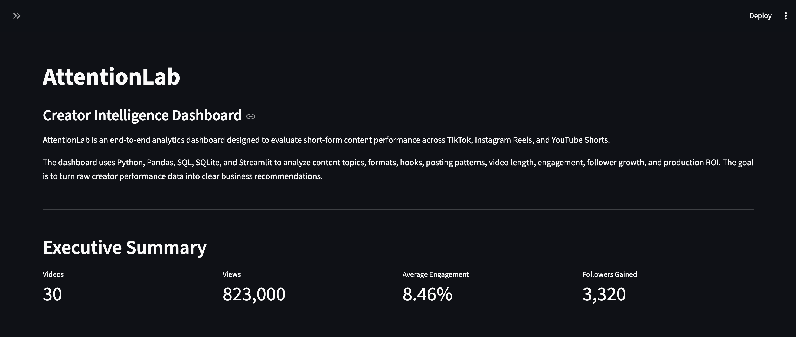
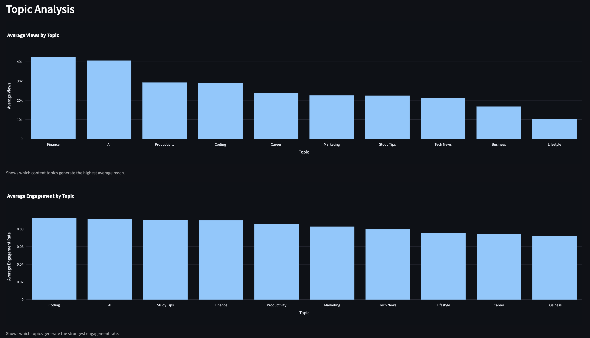
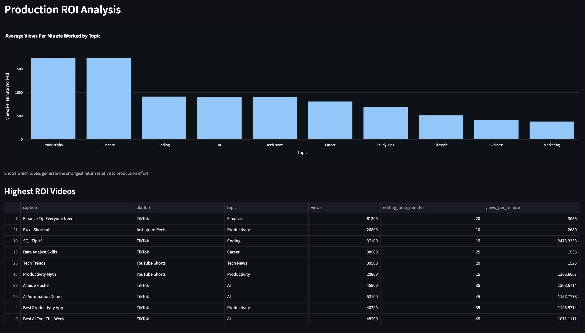
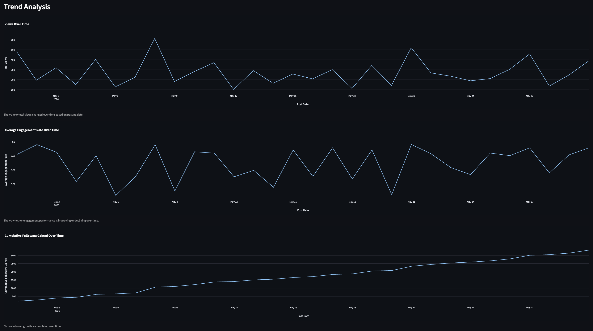
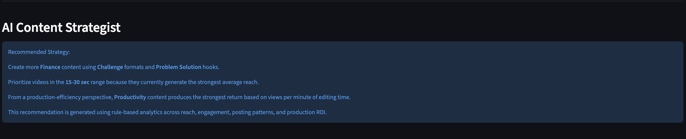

# AttentionLab | Creator Analytics Platform



AttentionLab is an end-to-end creator analytics platform that transforms short-form content performance data into actionable business recommendations.

Built with **Python, Pandas, SQL, SQLite, Plotly, and Streamlit**, the platform analyzes content across **TikTok, Instagram Reels, and YouTube Shorts** to identify which topics, formats, hooks, posting patterns, video lengths, and production workflows generate the strongest engagement and return on production effort.

---

# Business Problem

Content creators publish hundreds of videos every year, yet many decisions are still based on intuition rather than data.

Questions such as:

- Which topics consistently perform best?
- Which hook styles maximize engagement?
- Does posting day affect performance?
- What video length generates the strongest ROI?
- How much editing effort is actually worthwhile?

are difficult to answer without structured analytics.

AttentionLab helps answer these questions through an end-to-end analytics workflow that transforms raw performance data into business recommendations.

---

# Business Impact

AttentionLab enables creators to make data-driven content decisions instead of relying on guesswork.

The platform helps identify:

- High-performing content categories
- Strongest engagement drivers
- Best posting windows
- Most efficient production workflows
- Highest ROI content opportunities

Rather than simply displaying charts, the dashboard converts creator performance data into actionable recommendations that can improve future content strategy.

---

# Dashboard Preview

### Executive Dashboard


### Topic Performance Analysis



### Production ROI Analysis



### Trend Analysis



### AI Content Strategist



---

# Core Features

## Executive Dashboard

- Executive KPI summary
- Total views
- Average engagement rate
- Followers gained
- Interactive dashboard filters

## Content Performance Analysis

- Topic performance analysis
- Format performance analysis
- Hook performance analysis
- Video length analysis
- Top-performing content identification

## Posting Pattern Analysis

- Day-of-week performance
- Weekday vs. weekend comparison
- Posting trend analysis

## Production ROI Analysis

- Views per minute worked
- Engagement per minute worked
- High ROI content identification
- Editing efficiency analysis

## AI Content Strategist

- Rule-based recommendation engine
- Best-performing topics
- Best-performing hooks
- Best-performing formats
- Best posting schedule
- Highest ROI strategy recommendations

---

# Data Pipeline

```text
Raw CSV Data
        │
        ▼
Data Cleaning (Pandas)
        │
        ▼
Feature Engineering
        │
        ▼
SQLite Database
        │
        ▼
SQL Analytics
        │
        ▼
Interactive Streamlit Dashboard
        │
        ▼
Business Recommendations
```

---

# Tech Stack

| Category | Technologies |
|-----------|--------------|
| Programming | Python |
| Data Processing | Pandas |
| Database | SQLite |
| Query Language | SQL |
| Dashboard | Streamlit |
| Visualization | Plotly |

---

# Skills Demonstrated

## Data Engineering

- Data cleaning
- Feature engineering
- KPI development
- Metric calculation
- Data transformation

## Analytics

- SQL querying
- Trend analysis
- ROI analysis
- Business recommendation generation
- KPI reporting

## Dashboard Development

- Interactive filtering
- Executive reporting
- Data visualization
- Analytical storytelling

---

# Key Insights

Analysis of the creator dataset revealed several actionable insights:

- AI-related content generated the highest average reach.
- Tutorial-style videos consistently produced stronger engagement.
- Videos between **15–30 seconds** achieved the strongest overall performance.
- Weekend publishing generated higher average views.
- Higher production effort did not always result in better performance, highlighting opportunities to optimize editing time.

---

# Business Recommendations

Based on the analysis, creators should:

- Prioritize high-performing content categories.
- Invest in tutorial-focused content formats.
- Publish more frequently during higher-performing posting windows.
- Optimize production workflows using ROI metrics.
- Allocate editing effort toward content categories with the highest return.

---

# Future Improvements

Potential future enhancements include:

- Automated TikTok, Instagram, and YouTube API integration
- Cloud deployment for public access
- Machine learning models for performance prediction
- A/B testing framework for content experiments
- Automated executive reporting
- Multi-user creator dashboards

---

# Project Structure

```text
AttentionLab/
│
├── dashboard/
│   └── apps.py
│
├── data/
│   ├── raw_attentionlab_data.csv
│   ├── cleaned_attentionlab_data.csv
│   └── attentionlab.db
│
├── notebooks/
│   ├── data_cleaning.ipynb
│   └── sql_analyst.ipynb
│
├── sql/
│   ├── create_database.py
│   └── analyst_queries.sql
│
├── docs/
│   └── case_study.md
│
├── images/
│
└── README.md
```

---

# Running the Project

Clone the repository:

```bash
git clone <repository-url>
```

Install dependencies:

```bash
pip install -r requirements.txt
```

Launch the dashboard:

```bash
streamlit run dashboard/apps.py
```

---

# What I Learned

Through this project, I strengthened my ability to:

- Design an end-to-end analytics workflow.
- Engineer meaningful business KPIs from raw data.
- Build relational databases using SQLite.
- Analyze structured data with SQL.
- Develop interactive dashboards using Streamlit and Plotly.
- Translate analytical findings into actionable business recommendations.
- Communicate technical insights to business stakeholders through data storytelling.

---

# Author

**Wilson Zheng**

University of Virginia

B.S. Computer Science & Applied Statistics

Interested in Data Analytics, Business Analytics, Business Intelligence, and Product Analytics.
